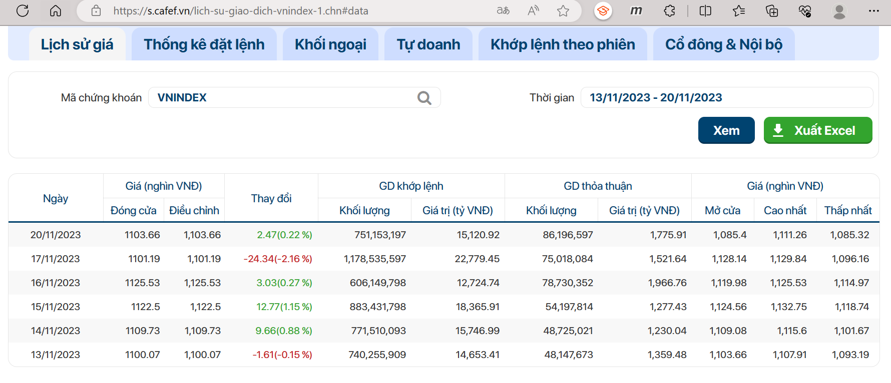
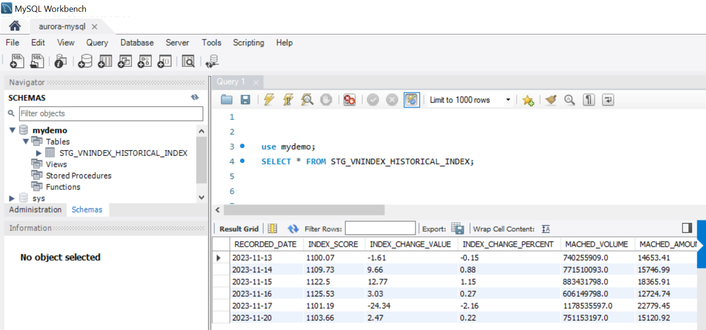

<h2>Introduction</h2>
AWS Serverless services are utilized in this experiment to demonstrate its capabilities for Data Warehousing. The pipeline will extract the data of Vietnam stock market, which are then cleaned, transformed and loaded to Amazon Aurora Serverless.

Medium blog: https://medium.com/@minhdinh1305/aws-serverless-an-alternative-to-on-premise-for-data-warehousing-235d64b850ec

<h2>Architecture</h2>

The experiment involves different AWS services like IAM, ECR, ECS, Lambda, CloudWatch, EventBridge, SNS, S3, Glue, and Aurora.

<h2>Design of Experiment</h2>

 The experiment is conducted in the following steps:
- **Step 1**: Build a Docker image of an API application to scrape the data from the source, the image is stored in ECR. 
- **Step 2**: Develop a Lambda function to run the container from Step 1. Send a request to the API to retrieve the data and save into S3. 
- **Step 3**: Create a Glue Pyspark job to load the data from S3, clean the data, and import it into Aurora. 
- **Step 4**: Create an SNS topic to send the Cloudwatch logs of the data pipeline (success/failure) to users’ email. 
- **Step 5**: Scheduling the whole pipeline using EventBridge

<h2>Main Components</h2>

<h3>1. Docker Image:</h3>

Build a Docker Image for an API, which use Selenium (with Chrome driver) to scrape the data from the stock website and then return result.

Source: https://github.com/minhdc2/AWS-Severless-for-Data-Warehousing/tree/main/ecr

<h3>2. Lambda Functions:</h3>

The Lambda functions were developed and deployed using **AWS SAM framework**.

- **extract_data**: Retrieve scraped data from API in .csv file and store in S3.
- **start_glue_workflow**: Trigger the Glue Workflow when a new data file landing in S3.
- **start_aurora**: Start Aurora database.
- **stop_aurora**: Stop Aurora database (to save cost).

Source: https://github.com/minhdc2/AWS-Severless-for-Data-Warehousing/tree/main/lambda

<h3>3. Glue (PySpark) Jobs:</h3>

Developed locally using Glue Docker Image, and set up CI/CD pipeline to update code changes to AWS using CodeCommit, CodeBuild, and CodePipeline.

- **clean.py**: Retrieve scraped data from API in .csv file and store in S3.
- **increment.py**: Update new data to existing table in Aurora.

Source: https://github.com/minhdc2/AWS-Severless-for-Data-Warehousing/tree/main/glue

<h3>4. Result:</h3>

**Source**:

**Target**:

